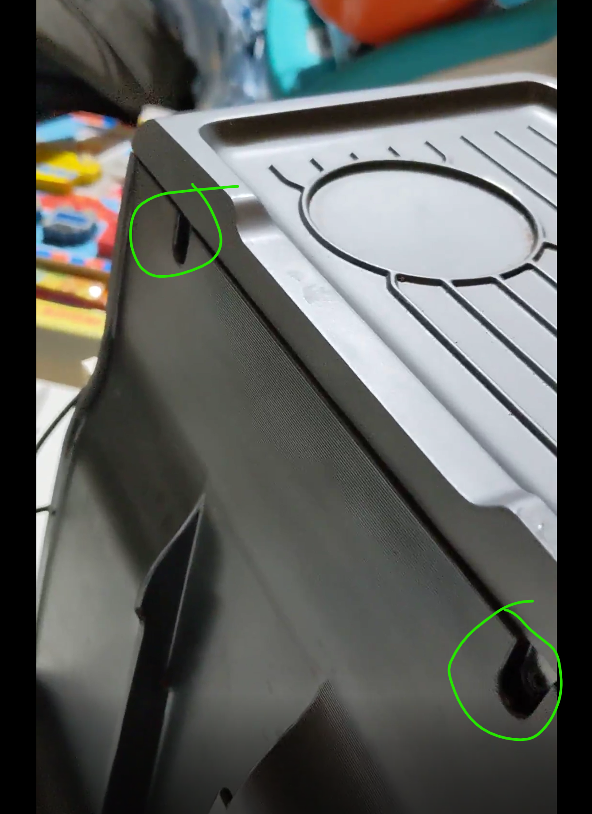
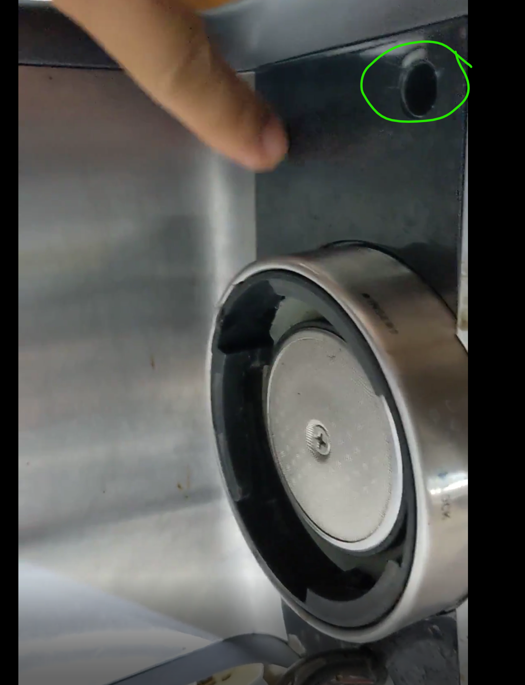

# Calphalon TempIQ Dimmer Mod

##Requirements:

- Calphalon TempIQ
- Dimmer : https://www.amazon.com/dp/B000FPCEH2?psc=1&ref=ppx_yo2ov_dt_b_product_details
- 16-14 AWG Spade Connectors: https://www.amazon.com/dp/B08BZ8FQ6G/
- 6mm Tri-wing Screwdriver (minimum of 3.5" shaft): https://www.amazon.com/dp/B07V6WNRMT?psc=1&ref=ppx_yo2ov_dt_b_product_details
- Phillips head Screwdriver
- 16 or 18 AWG wire

## Steps:

###Remove Top Cover:

 - First remove the water resevoir.

 - There are 4 screws that hold the top cover in place:
   - 2 in the back near the top of the case.
    
    

   - 2 are located in the front in long recessed holes.  The ones in front are tri-wing screws that require a long 6mm tri-wing screwdriver.  This was the hardest part of the process
    
